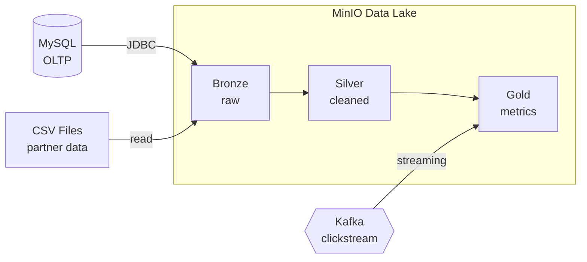
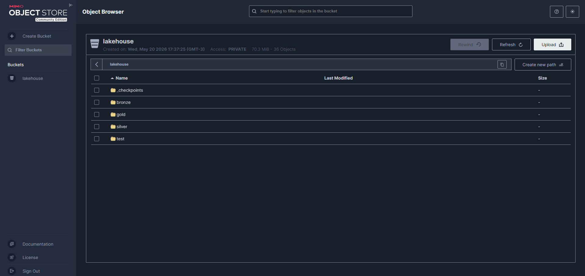
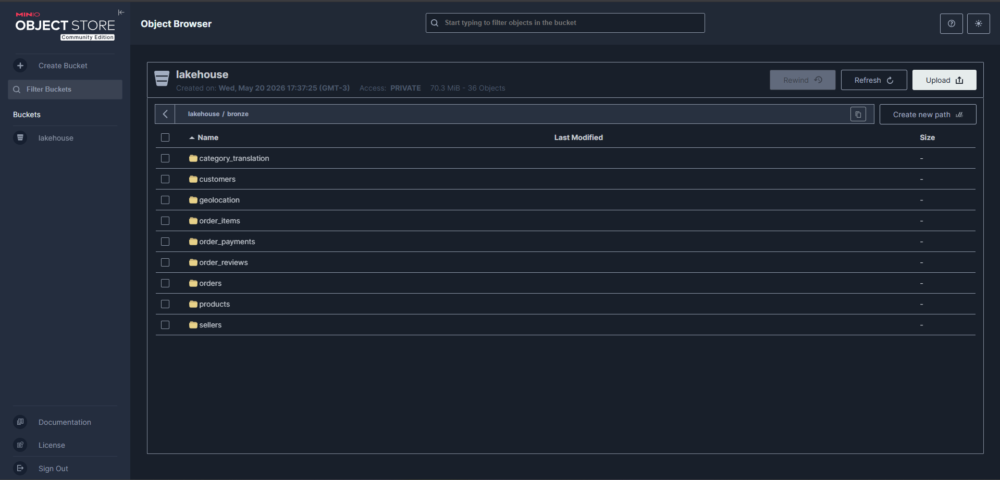
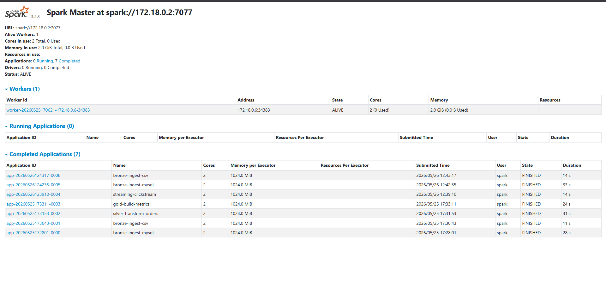
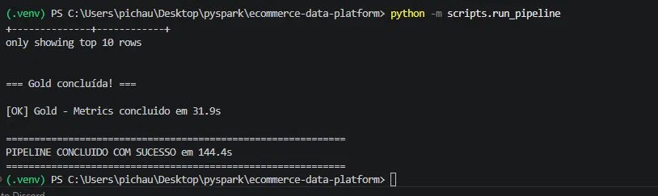

# E-commerce Data Platform

> End-to-end data engineering platform processing Brazilian e-commerce data with PySpark, implementing the medallion architecture (Bronze to Silver to Gold), real-time streaming, and pipeline orchestration — fully containerized with Docker.


## Overview

This project simulates the complete data infrastructure of an e-commerce company. Data originates in a transactional MySQL database and partner CSV files, flows through an Apache Spark cluster, and lands in a MinIO data lake organized in the medallion architecture. It includes both batch processing (the main pipeline) and streaming (real-time clickstream events via Kafka), all orchestrated and reproducible with a single command.

Built using the real [Brazilian E-commerce Public Dataset by Olist](https://www.kaggle.com/datasets/olistbr/brazilian-ecommerce) (~100k orders).

## Architecture



Full architecture details in [docs/architecture.md](docs/architecture.md).

## Tech Stack

| Layer | Technology |
|-------|-----------|
| Processing | Apache Spark 3.5 (PySpark), standalone cluster |
| Storage | MinIO (S3-compatible object storage), Parquet |
| Database | MySQL 8 (transactional source) |
| Streaming | Apache Kafka 3.8 (KRaft mode) |
| Exploration | Jupyter Lab |
| Orchestration | Python pipeline orchestrator |
| Infrastructure | Docker Compose |
| Language | Python 3.11 |

## Features

- **Multi-source ingestion** — reads from a relational database (JDBC) and flat files (CSV)
- **Medallion architecture** — Bronze (raw), Silver (cleaned and typed), Gold (business metrics)
- **Real-time streaming** — synthetic clickstream events through Kafka, processed with Spark Structured Streaming and time-window aggregations
- **Orchestrated pipeline** — single command runs the full Bronze to Gold flow with error handling
- **Fully containerized** — the entire stack (Spark cluster, MinIO, MySQL, Kafka, Jupyter) runs with `docker compose up`

## Project Structure

```
├── docker/mysql/init/      # MySQL init scripts
├── jobs/
│   ├── bronze/             # Ingestion jobs (MySQL, CSV)
│   ├── silver/             # Cleaning & standardization
│   ├── gold/               # Business aggregations
│   └── streaming/          # Spark Structured Streaming consumer
├── streaming/              # Kafka event producer
├── scripts/                # Data loaders & pipeline orchestrator
├── utils/                  # Shared Spark helpers
├── notebooks/              # Jupyter exploration
├── docs/                   # Architecture & documentation
├── docker-compose.yml      # Full infrastructure definition
├── manage.ps1              # Environment management helper
└── run_job.ps1             # Spark job runner
```

## Getting Started

### Prerequisites

- Docker Desktop
- Python 3.11 (for local scripts)
- A Kaggle account to download the [Olist dataset](https://www.kaggle.com/datasets/olistbr/brazilian-ecommerce)

### Setup

1. Clone and enter the repo:
```bash
   git clone https://github.com/SEU_USUARIO/ecommerce-data-platform.git
   cd ecommerce-data-platform
```

2. Create your `.env` from the template:
```bash
   cp .env.example .env
   # edit .env with your values
```

3. Download the Olist dataset and extract the CSVs into `data/raw/olist/`.

4. Set up the Python environment:
```bash
   python -m venv .venv
   .venv\Scripts\Activate.ps1   # Windows
   pip install -r requirements.txt
```

5. Start the infrastructure:
```powershell
   .\manage.ps1 up
```

6. Load the source data into MySQL:
```powershell
   python -m scripts.load_mysql
```

### Running the batch pipeline

```powershell
python -m scripts.run_pipeline
```

This runs the full flow: Bronze (MySQL + CSV) to Silver to Gold.

### Running streaming (optional)

In separate terminals:

```powershell
# Terminal 1 — produce events
python -m streaming.producer

# Terminal 2 — consume with Spark
docker compose exec -e PYTHONPATH=/app spark-client /opt/spark/bin/spark-submit `
  --master spark://spark-master:7077 `
  --packages org.apache.spark:spark-sql-kafka-0-10_2.12:3.5.3,org.apache.hadoop:hadoop-aws:3.3.4,com.amazonaws:aws-java-sdk-bundle:1.12.262 `
  --conf spark.jars.ivy=/tmp/.ivy2 `
  /app/jobs/streaming/consume_clickstream.py
```

## Services

| Service | URL | Notes |
|---------|-----|-------|
| Spark Master UI | http://localhost:8080 | cluster monitoring |
| Spark Worker UI | http://localhost:8081 | worker details |
| MinIO Console | http://localhost:9001 | data lake browser |
| Jupyter Lab | http://localhost:8888 | interactive exploration |
| MySQL | localhost:3307 | transactional source |
| Kafka | localhost:29092 | event streaming |

## Data Layers (Medallion)

- **Bronze** (`s3a://lakehouse/bronze/`) — raw data as ingested, with ingestion metadata. No transformations.
- **Silver** (`s3a://lakehouse/silver/`) — deduplicated, type-cast (timestamps, standardized strings), validated.
- **Gold** (`s3a://lakehouse/gold/`) — business-ready aggregations (orders by status, orders by state, streaming metrics).


## Screenshots

### Data Lake — Medallion architecture in MinIO


### Bronze layer — 9 ingested tables (MySQL + CSV sources)


### Spark Cluster — completed applications across pipeline stages


### Pipeline orchestrator execution


## Roadmap

- [x] Phase 0: Project setup
- [x] Phase 1: Docker environment
- [x] Phase 2: Bronze layer (ingestion)
- [x] Phase 3: Silver layer (cleaning)
- [x] Phase 4: Gold layer (aggregations)
- [x] Phase 5: Streaming with Kafka
- [x] Phase 6: Pipeline orchestration
- [ ] Future: Apache Airflow, Delta Lake, dbt, CI/CD

## License

MIT