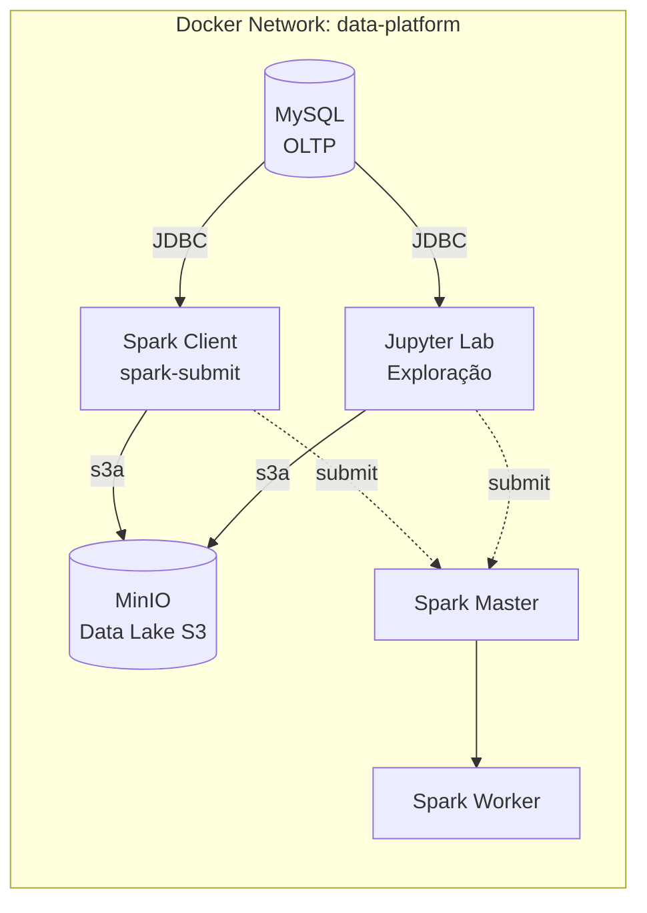
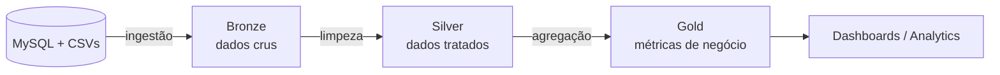

# Arquitetura da Plataforma

## Visão geral

## Medallion Architecture (camadas)

## Componentes

| Serviço | Função | Porta (host) |
|---------|--------|--------------|
| spark-master | Coordena o cluster | 8080 (UI), 7077 |
| spark-worker | Executa tarefas | 8081 (UI) |
| spark-client | Submete jobs via spark-submit | — |
| minio | Object storage (data lake) | 9000 (API), 9001 (console) |
| mysql | Banco transacional (fonte) | 3307 |
| jupyter | Exploração interativa | 8888 |

## Fluxo de dados

1. **Ingestão**: Spark lê do MySQL (JDBC) e de arquivos CSV
2. **Bronze**: dados crus salvos em Parquet no MinIO (`s3a://lakehouse/bronze/`)
3. **Silver**: limpeza, padronização e deduplicação (`s3a://lakehouse/silver/`)
4. **Gold**: agregações e métricas de negócio (`s3a://lakehouse/gold/`)